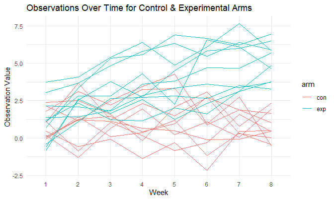
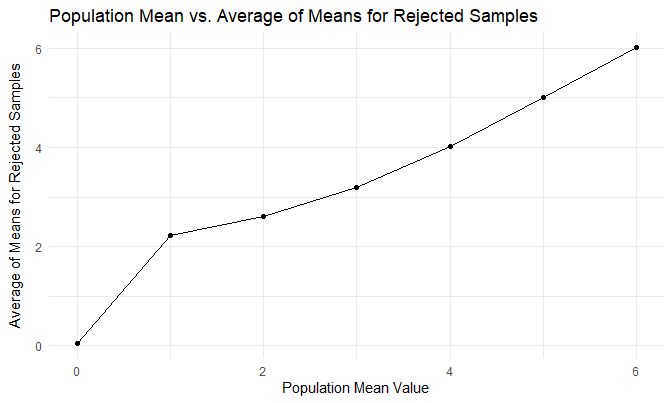

Homework 5
================
Rachel Heise
11/18/2020

## Problem 1

The data set used for this problem contains data on over 52,000 records
of homicides in some of the largest US cities. The raw data contains
information on the victims (name, race, age, and sex), as well as
information on where and when each homicide occurred; this includes
city, state, latitude, and longitude. Finally, the data contains a
record of the status of each homicide and whether or not they are open
or closed.

Import and clean data.

``` r
homicide_df =
  read_csv("./homicide_data/homicide-data.csv") %>% 
  mutate(
    city_state = str_c(city, state, sep = "_"),
    resolved = case_when(
      disposition == "Closed without arrest" ~ "unsolved",
      disposition == "Open/No arrest"        ~ "unsolved",
      disposition == "Closed by arrest"      ~ "solved",
    )
  ) %>% 
  select(city_state, resolved) %>% 
  filter(city_state != "Tulsa_AL")
```

Summarize within cities - total number of homicides and number of
unsolved homicides.

``` r
aggregate_df =
  homicide_df %>% 
  group_by(city_state) %>% 
  summarize(
    hom_total = n(),
    hom_unsolved = sum(resolved == "unsolved")
  )
```

Prop test for the city of Baltimore, MD.

``` r
baltimore_test = prop.test(
  aggregate_df %>% filter(city_state == "Baltimore_MD") %>% pull(hom_unsolved),
  aggregate_df %>% filter(city_state == "Baltimore_MD") %>% pull(hom_total)) %>% 
  broom::tidy()

balti_estimate = baltimore_test %>% pull(estimate)

balti_ci_low = baltimore_test %>% pull(conf.low)

balti_ci_high = baltimore_test %>% pull(conf.high)
```

The estimate for the proportion of homicides that are unsolved is
0.6455607, and the confidence interval is (0.6275625, 0.6631599).

Run prop test for each city in the dataset.

``` r
results_df =
  aggregate_df %>% 
  mutate(
    prop_tests = map2(.x = hom_unsolved, .y = hom_total, ~prop.test(x = .x, n = .y)),
    tidy_tests = map(.x = prop_tests, ~broom::tidy(.x))) %>% 
  select(-prop_tests) %>% 
  unnest(tidy_tests) %>% 
  select(city_state, estimate, conf.low, conf.high)
```

``` r
results_df %>% 
  mutate(city_state = fct_reorder(city_state, estimate)) %>% 
  ggplot(aes(x = city_state, y = estimate)) +
  geom_point() +
  geom_errorbar(aes(ymin = conf.low, ymax = conf.high)) +
  theme(axis.text.x = element_text(angle = 90, vjust = 0.5, hjust = 1)) +
  labs(
    title = "Proportion of Unsolved Homicides by City",
    x = "City",
    y = "Est. Proportion of Unsolved Homicides"
  ) +
  theme(axis.title.y = element_text(margin = margin(t = 0, r = 10, b = 0, l = 0)))
```


## Problem 2

Create dataframe containing names of data files. Add data from each file
to dataframe.

``` r
longitudinal_df =
  tibble(files = list.files("./lda_data/")) %>% 
  mutate(data = map(file.path("./lda_data/", files), read_csv)) %>% 
  unnest(data) %>% 
  pivot_longer(week_1:week_8,
               names_to = "week",
               values_to = "observation") %>% 
  mutate(week = substr(week, 6, 7),
         files = substr(files, 1, 6),
         full_subject = files) %>% 
  separate(files, into = c("arm", "subject_id"), sep = "_")
```

Spaghetti plot

``` r
longitudinal_df %>% 
  ggplot(aes(x = week, y = observation, group = full_subject, color = arm)) +
  geom_line() +
  labs(
    title = "Observations Over Time for Control & Experimental Arms",
    x = "Week",
    y = "Observation Value"
  )
```



Overall, it appears that the observations were higher for the
experimental group than the control arm. In fact, by week 8 all of the
observation values for the experimental group were higher than the
control group. It also looks like the observations for the experimental
group increased over time for participants.

## Problem 3

Create a function to create a random sample from a normal distribution
with specified sample size, mean, and sigma, which then runs a t test on
that sample.

``` r
set.seed(1)
t_test_sim = function(samp_size = 30, sigma = 5, mu) {
  
  sim_data = tibble(
    x = rnorm(n = samp_size, mean = mu, sd = sigma)
  )
  
  test = t.test(sim_data, mu = 0)
  
  sim_data %>% 
    summarize(
      est_mean = mean(x),
      p_value = pull(broom::tidy(test), p.value)
  )
}
```

Generate 5000 samples each for values of mu from 0 to 6 and save in a
results dataframe.

``` r
sim_results = tibble(
  pop_mean = c(0:6)
) %>% 
  mutate(
  output_lists = map(.x = pop_mean, ~rerun(5000, t_test_sim(mu = .x))),
  estimate_df = map(output_lists, bind_rows)
  ) %>% 
  select(-output_lists) %>% 
  unnest(estimate_df)
```

``` r
sim_results %>% 
  group_by(pop_mean) %>% 
  summarize(n_reject = sum(p_value < 0.05),
            prop_reject = n_reject/5000) %>% 
  ggplot(aes(x = pop_mean, y = prop_reject)) +
  geom_point() +
  geom_line() +
  labs(title = "True Mean vs. Proportion of Samples Rejected",
       y = "Proportion of Samples Rejected",
       x = "Population Mean") +
  theme(axis.title.y = element_text(margin = margin(t = 0, r = 10, b = 0, l = 0)))
```


The greater the effect size, the greater the power will be because you
are more easily able to correctly reject a false null hypothesis. In the
plot above, we can see that as the population mean increases we are able
to reject a greater proportions of the samples and conclude the
population means are not equal to 0 with greater frequency.

``` r
sim_results %>% 
  group_by(pop_mean) %>% 
  summarize(avg = mean(est_mean)) %>% 
  ggplot(aes(x = pop_mean, y = avg)) +
  geom_point() +
  geom_line() +
  labs(title = "True Mean vs. Average Estimated Mean",
       x = "True Mean Value",
       y = "Average Estimated Mean Value") +
  theme(axis.title.y = element_text(margin = margin(t = 0, r = 10, b = 0, l = 0)))
```


``` r
sim_results %>% 
  filter(p_value < 0.05) %>% 
  group_by(pop_mean) %>% 
  summarize(avg = mean(est_mean)) %>% 
  ggplot(aes(x = pop_mean, y = avg)) +
  geom_point() +
  geom_line() +
  labs(title = "Population Mean vs. Average of Means for Rejected Samples",
       x = "Population Mean Value",
       y = "Average of Means for Rejected Samples") +
  theme(axis.title.y = element_text(margin = margin(t = 0, r = 10, b = 0, l = 0)))
```



For the population means of 0, 4, 5, and 6, the mean values of the
sample means which reject the null are very close to the population
mean. However, for population means of 1, 2, and 3, there is more of a
difference between population means and sample means. This makes sense
because for 0, the samples that are rejected will likely fall equally on
either side of the value 0. When the population mean is 1, far fewer
values will be rejected below 0, because there will be far fewer sample
means far enough below 0 to reject. Many more samples for population
mean 1 will be rejected for being higher than 0. This trend will
continue up until 4, 5, and 6, where almost all sample means will be
rejected so the average of the sample means will be approximately equal
to the population mean because those samples that are rejected comprise
most of the samples.
